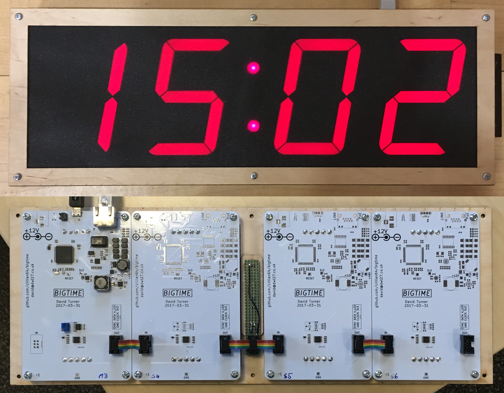

# bigtime
A rather large wall clock using big 7-segment displays, powered by 802.3af
power-over-ethernet, and synchronised using NTP over wired ethernet.
Configuration is done using an interactive USB shell and stored in flash.

One of these clocks is deployed in each of Lecture Theatres 1 and 2 at the
[Department of Computer Science and Technology](https://www.cst.cam.ac.uk/)
(formerly known as the [Computer Lab](https://www.cl.cam.ac.uk/)), [University
of Cambridge](https://www.cam.ac.uk/), UK.

